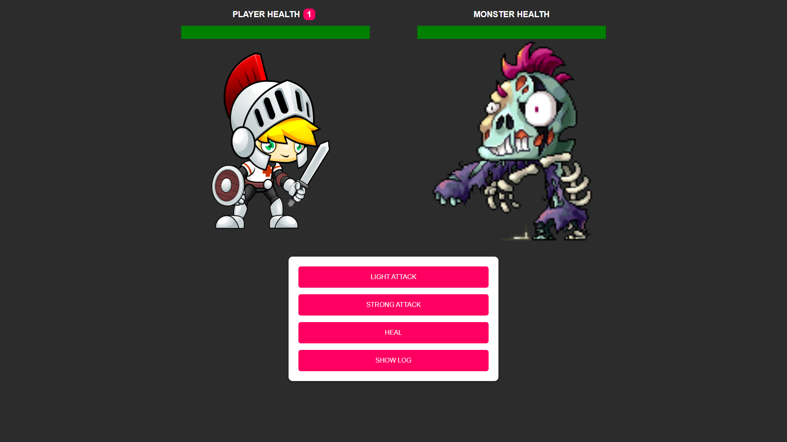
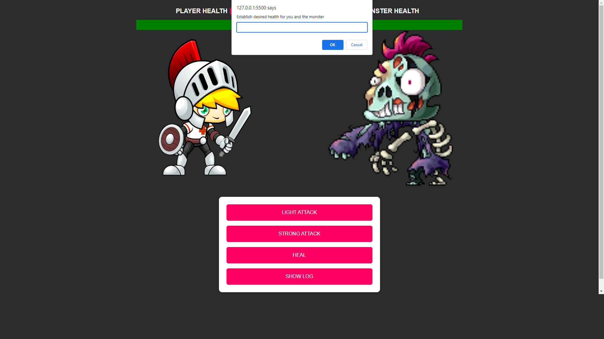
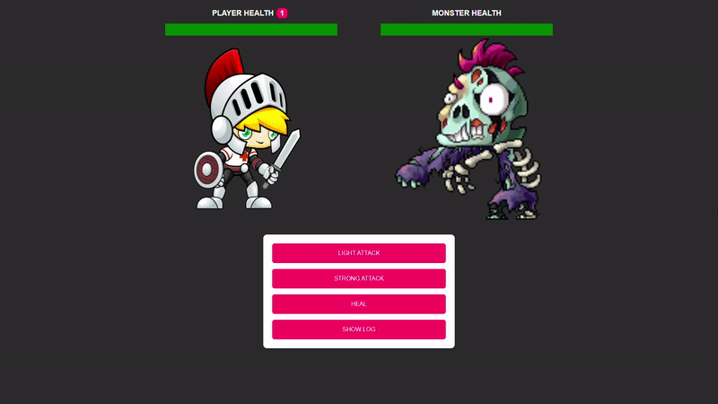
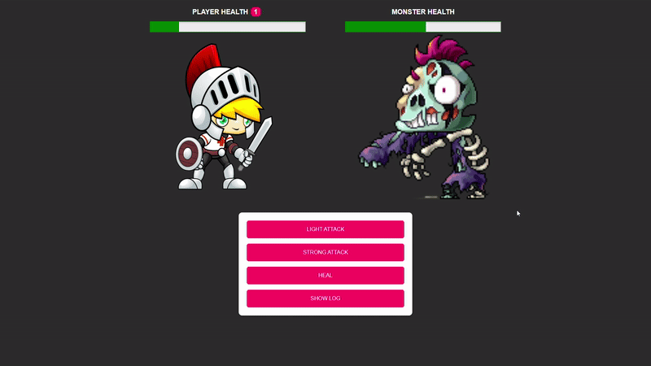
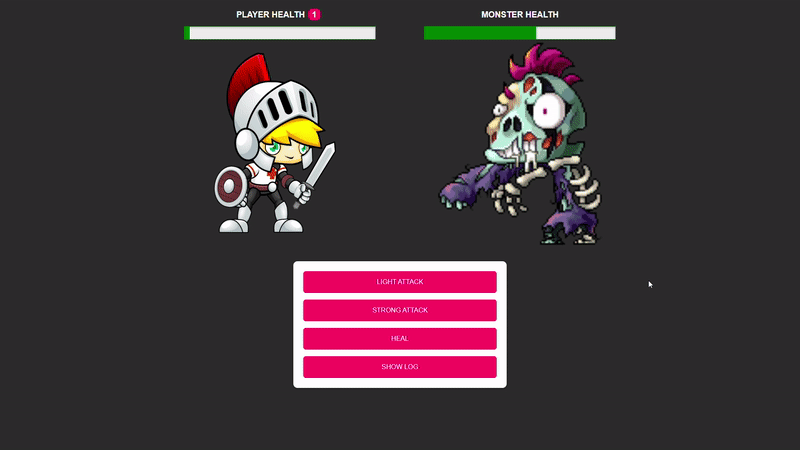
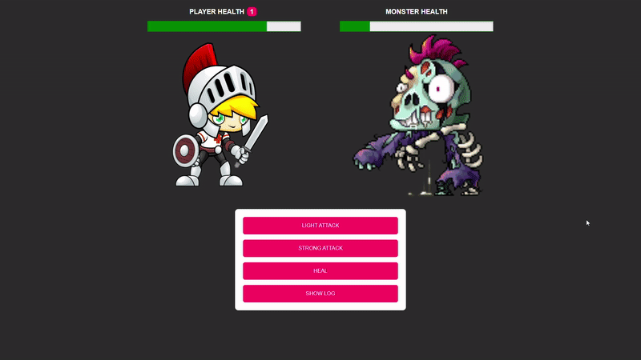

# Knight-Apocalypse
JS - Game (Knight vs Zombie)

This game was inspired from a JS tutorial from <a href='https://www.udemy.com/user/academind/'>Maximilian Schwarzmüller</a>. Off of his tutorial I have derived my own version of the game independently!

# How to Play

The aim of the game is to deplete the zombies HP bar before your own HP bar runs out. Everytime you attack the zombie the monster will also attack you! Both the damage of every attack for the user and the zombie is completely randomised as to insure an unpredictable game.

1) As soon as the user has loaded into the game they'll be prompted to enter a set health for themself and the zombie.

2) The user can then attack the zombie with both light attacks and heavy attacks!

3) If the user finds themself on low heath they can then press the heal button for a chance to recover!

4) If it's the users first time running out of health then they'll be given a second chance to make a come back. However, if it's their second time the user will lose the game and will be prompted to play again!

5) Once the user has successfully depleted the zombie's HP bar the user will win and be prompted to play again!

